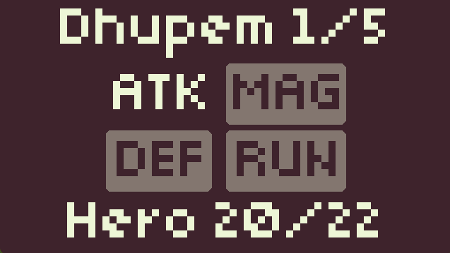
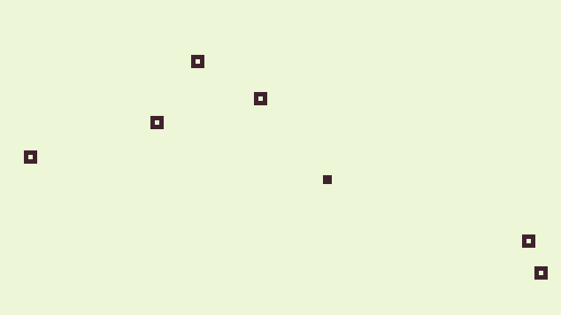
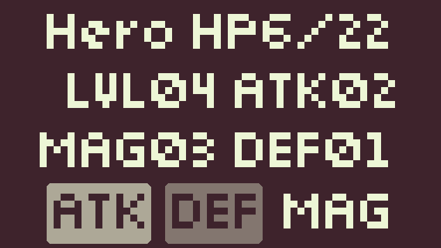

# (dot)RPG

## Become the hero in a journey to slay the fearsome Dragon!

## Featuring

- ⚔️ Turn-based battles!
- 🐉 Ten enemy types!
- 🎨 1-bit, low res aesthetic!
- 🆙 Level up your Hero!
- 🤔 Strategy and Skill!

This game was created for [GDFG's Monthly Game Jam #22](https://itch.io/jam/gdfgs-monthly-game-jam-22) with the theme: Simplicity.

The game is _probably_ beatable 😆 Please raise issues for any bugs that you find!

## Screenshots

## Controls

- Arrow Keys to move around
- Mouse or Arrow Keys + Enter for menus
- ESC to Pause
- S for the Hero Stats Page
- _Touch Controls on Mobile supported (not fully tested)_
- _Joypad Controls supported (not fully tested)_

## Credits

- Programming and Art by [nuzcraft](https://nuzcraft.itch.io/)
- Font by [Mash Arcade](https://masharcade.itch.io/bitty)
- Sounds by [Kenney](https://kenney.nl/)
- Music by [Brandon Morris](https://opengameart.org/content/bleeding-out)
- Project Template by [Crystal Bit](https://github.com/crystal-bit/godot-game-template)
